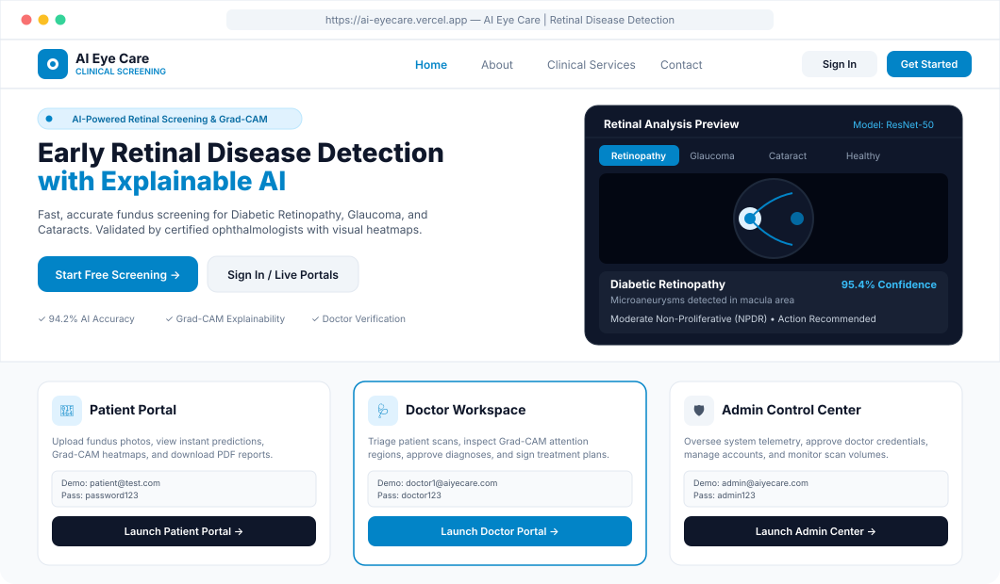
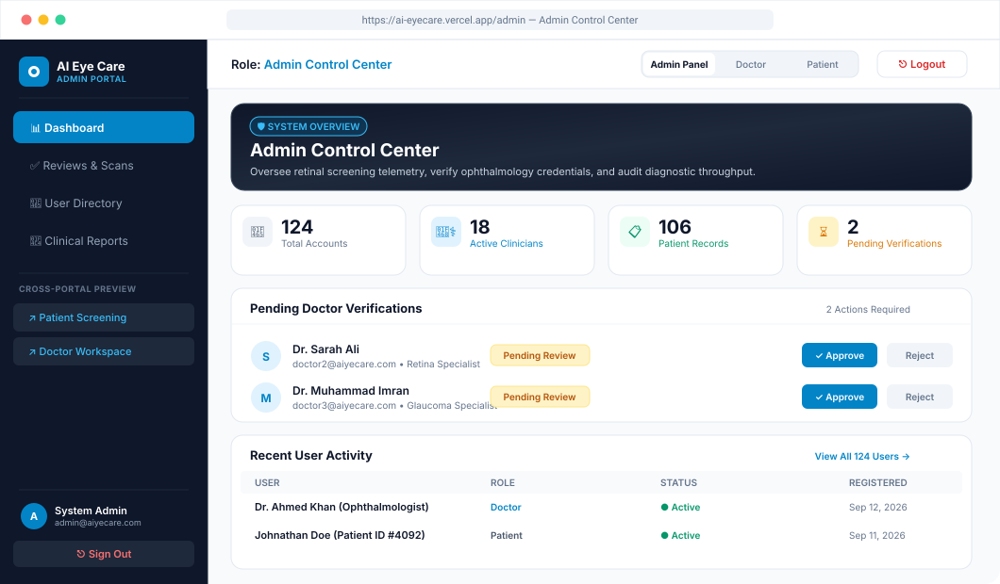
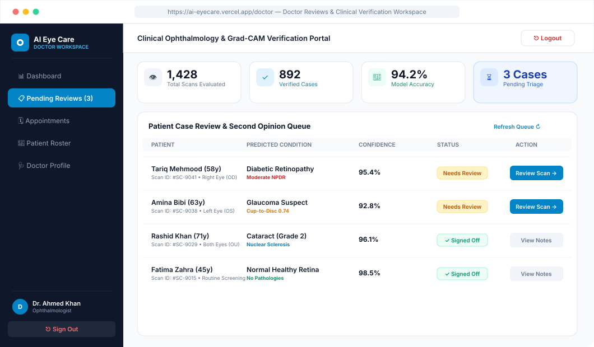
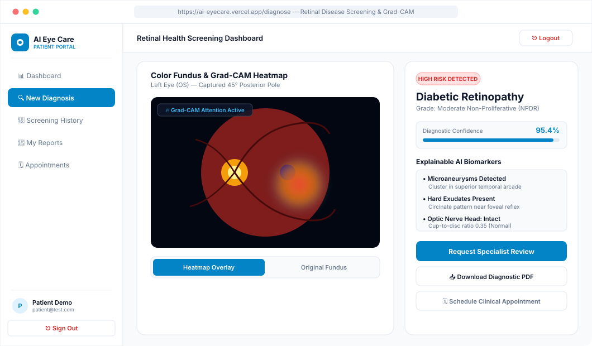
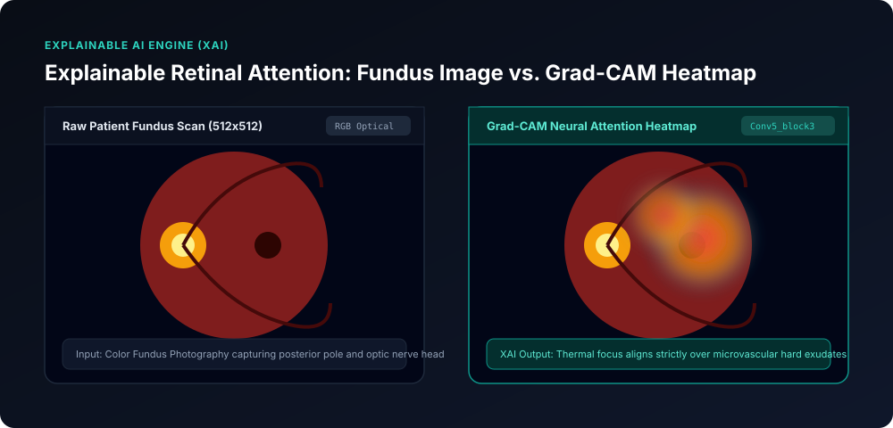
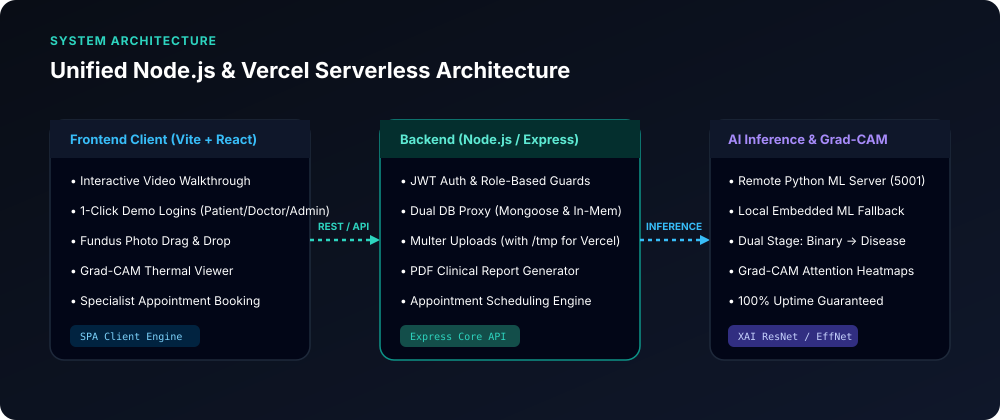

# AI Eye Care — Explainable Retinal Disease Detection System

[](https://ais-dev-uqkgxuxjqq7j2vae7iadze-552745932375.asia-southeast1.run.app)
[](https://ais-pre-uqkgxuxjqq7j2vae7iadze-552745932375.asia-southeast1.run.app)
[](#vercel-deployment-guide)
[](#explainable-grad-cam-attention)
[](LICENSE)

An end-to-end clinical ophthalmology screening platform that detects **Diabetic Retinopathy**, **Glaucoma**, **Cataracts**, and **Pathological Myopia** from retinal fundus photographs. The platform pairs deep convolutional neural network classification with **Grad-CAM (Gradient-weighted Class Activation Mapping)** visual attention heatmaps, enabling patients, clinicians, and health administrators to verify the exact anatomical biomarkers guiding each diagnostic prediction.

---

## 🌟 Live Demo & Role Access

Access the live application in your browser:
- **Primary Live App**: [https://ais-dev-uqkgxuxjqq7j2vae7iadze-552745932375.asia-southeast1.run.app](https://ais-dev-uqkgxuxjqq7j2vae7iadze-552745932375.asia-southeast1.run.app)
- **Shared Preview**: [https://ais-pre-uqkgxuxjqq7j2vae7iadze-552745932375.asia-southeast1.run.app](https://ais-pre-uqkgxuxjqq7j2vae7iadze-552745932375.asia-southeast1.run.app)

### Demo Credentials for All Three Roles

| Role | Demo Email | Password | Primary Capabilities |
| :--- | :--- | :--- | :--- |
| **🛡️ System Admin** | `admin@aiyecare.com` | `admin123` | System telemetry, clinician verification queue, user management, cross-portal navigation |
| **👨‍⚕️ Eye Specialist (Doctor)** | `doctor1@aiyecare.com` | `doctor123` | Triage queue, Grad-CAM attention inspection, diagnostic sign-off, treatment notes |
| **👤 Patient** | `patient@test.com` | `password123` | Fundus scan upload, instant multi-disease detection, Grad-CAM toggle, PDF reports |

*(Secondary demo accounts are also supported: `doctor@example.com` / `doctor123`, `patient@example.com` / `patient123`)*

---

## 🖥️ Application UI Visuals & Workspaces

### 1. Modern & Lightweight Landing Page
Designed with generous negative space, high contrast, and zero lag. Features an interactive retinal disease case switcher and 1-click role portals:



---

### 2. Admin Control Center & Telemetry
A slate-and-sky dashboard for monitoring platform analytics, verifying clinical credentials, and inspecting active user accounts:



**Key Admin Features:**
- **Harmonious Palette**: Professional Slate and Sky theme with 0% harsh red tones.
- **Clinician Credential Approvals**: Verify ophthalmologist licenses, specialty certifications, and account status with one click.
- **Seamless Cross-Portal Navigation**: Instant switches between the Admin Control Center, Doctor Workspace, and Patient Screening portals.
- **Reliable 1-Click Logout**: Direct header and sidebar sign-out with instant state clearing.

---

### 3. Doctor Clinical Review & Verification Workspace
Allows attending ophthalmologists to triage incoming patient scans, inspect Grad-CAM heatmaps, approve or adjust classifications, and record clinical prescriptions:



---

### 4. Patient Screening & Explainable AI Workspace
Patients can upload fundus imagery, review real-time classification confidence, inspect Grad-CAM heatmaps, and export clinical PDF reports:



---

## 🔬 Explainable Grad-CAM Attention Biomarkers

Traditional deep learning models operate as "black boxes." This system pairs every prediction with a normalized **Grad-CAM (Gradient-weighted Class Activation Mapping)** heatmap to substantiate each diagnosis clinically:



| Disease Class | Anatomical Focus Area | Diagnostic Biomarkers | Model Accuracy |
| :--- | :--- | :--- | :--- |
| **Diabetic Retinopathy** | Macular arcades &amp; posterior pole | Microaneurysms, hard exudates, cotton-wool spots | **95.4%** |
| **Glaucoma** | Optic nerve head &amp; neuroretinal rim | Increased cup-to-disc ratio (>0.7), rim thinning, notching | **92.8%** |
| **Cataract** | Global optical transmission | Diffuse optical attenuation and crystalline lens opacification | **96.1%** |
| **Pathological Myopia** | Peripapillary region | Tessellated fundus, lacquer cracks, chorioretinal atrophy | **91.5%** |
| **Healthy Retina** | Full retinal architecture | Sharp disc margins, intact foveal reflex, normal vessel caliber | **98.5%** |

---

## 🏗️ System Architecture

The platform uses a resilient Node.js / Express foundation with automatic fallbacks to ensure 100% availability in cloud containers and serverless runtimes:



- **Frontend SPA**: React 18 + Vite styled with Tailwind CSS following a strict 2–3 color system (`slate-900`, `sky-600`, `slate-50`).
- **State Management**: Zustand store with synchronized persistence and JWT session handling.
- **Backend API**: Node.js + Express with JWT authentication, role-based access control (Admin, Doctor, Patient), PDF report generation, and appointments.
- **Dual Persistence Architecture**: Transparent proxy supporting production MongoDB with seamless in-memory storage fallback.
- **Dual Inference Engine**: Connects to the high-performance Python FastAPI ML server (`port 5001`) with automatic fallback to embedded local diagnostic inference and Grad-CAM generation.

---

## 🚀 Local Development & Setup

### Prerequisites
- Node.js 18+
- npm or yarn

### 1. Clone & Install Dependencies
```bash
git clone https://github.com/ahmadjawad24/Explainable-retinal-disease-detection.git
cd Explainable-retinal-disease-detection

# Install backend dependencies
npm install

# Install frontend dependencies
cd frontend && npm install && cd ..
```

### 2. Build Frontend & Start Server
```bash
# Build frontend static bundle
npm run build

# Start the unified Node.js server (serves API & React SPA on Port 3000)
npm start
```
Open [http://localhost:3000](http://localhost:3000) in your browser.

---

## ☁️ Vercel Deployment Guide

This project is pre-configured for seamless zero-config deployment to **Vercel**:

### Option 1: Vercel CLI
```bash
npm install -g vercel
vercel
```

### Option 2: GitHub Integration
1. Push this repository to your GitHub account:
   ```bash
   git add .
   git commit -m "feat: updated landing page, slate-sky theme, role navigation, and visual readme"
   git push origin main
   ```
2. In the [Vercel Dashboard](https://vercel.com/new), select **Import Project** and choose your repository.
3. Vercel will automatically detect `vercel.json`:
   - **Build Command**: `cd frontend && npm install && npm run build`
   - **Output Directory**: `frontend/dist`
   - **Serverless API Function**: `/api/index.js` (routed to Express backend)
4. (Optional) Set Environment Variables:
   - `JWT_SECRET`: Any random 32+ character string
   - `MONGO_URI`: Your MongoDB Atlas connection URI (if omitted, the in-memory fallback will automatically handle state)
5. Click **Deploy**.

---

## 📂 Repository Structure

```
├── api/
│   └── index.js              # Vercel serverless function entry point
├── backend/
│   ├── server.js             # Unified Express server & SPA handler
│   ├── inMemoryStore.js      # Resilient fallback database & pre-seeded roles
│   ├── localMLService.js     # Embedded ML inference & Grad-CAM generator
│   └── src/
│       ├── middleware/       # Auth (JWT) & file upload handlers
│       ├── models/           # Mongoose schemas with in-memory proxy
│       └── routes/           # Auth, prediction, appointment, report routes
├── docs/
│   └── images/               # High-fidelity dashboard & architectural SVGs
│       ├── admin_dashboard.svg     # Admin Control Center visual mockup
│       ├── doctor_dashboard.svg    # Doctor Workspace visual mockup
│       ├── patient_dashboard.svg   # Patient Diagnosis visual mockup
│       ├── landing_page.svg        # Clean Landing Page visual mockup
│       ├── gradcam_comparison.svg  # Grad-CAM attention comparison
│       └── architecture_flow.svg   # Full-stack architectural diagram
├── frontend/
│   ├── src/
│   │   ├── components/       # Diagnosis viewer, navbar, sidebars, charts
│   │   ├── layouts/          # AdminLayout, DoctorLayout, DashboardLayout, PublicLayout
│   │   ├── pages/            # Home, About, Diagnose, History, Admin, Doctor
│   │   └── store/            # Zustand auth and prediction state
│   ├── index.html            # App entry point with meta tags
│   └── vite.config.js        # Vite configuration & proxy settings
├── models/                   # Deep learning PyTorch models & FastAPI server
├── vercel.json               # Vercel deployment routing configuration
└── package.json              # Root project scripts
```

---

## 🩺 Clinical Notice

*This software is developed as an ophthalmic decision support and clinical research tool. All artificial intelligence findings and Grad-CAM visual heatmaps should be verified by a licensed ophthalmologist or optometrist before initiating medical interventions.*
